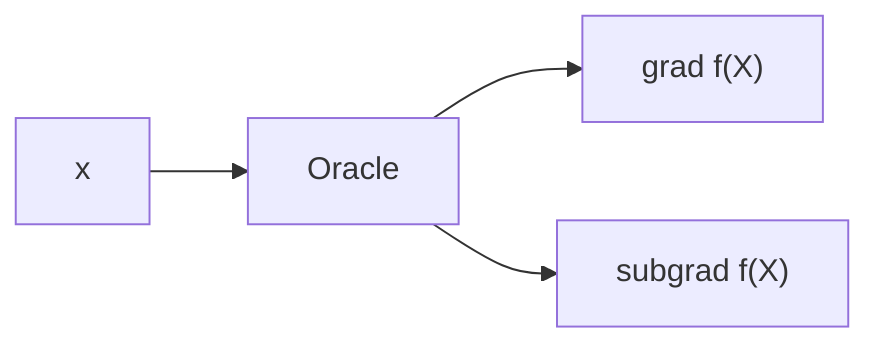

# Basic
## [youtube playlist](https://www.youtube.com/playlist?list=PLXsmhnDvpjORzPelSDs0LSDrfJcqyLlZc)
## Ref
1. Monograph by Sébastien Bubeck
2. Lecture notes by Lieven Vandenbergh at UCLA
3. Lecture notes by Stephen Boyd at Stanford
4. Lecture notes by Wotao Yin at UCLA

# Contents
## Convex Sets, functions, basic definitions. 
Optimality conditions for constrained possibly non-differentiable convex problems.
### Basics of linear algebra and calculus
### Convex Set 
$$
\forall x_1, x_2 \in \mathbb{C}, \forall \lambda \in [0,1], \lambda x_1 + (1-\lambda)x_2 \in \mathbb{C}
$$
### Convex Functions
$$
\forall x_1, x_2 \in \mathbb{R}^n, \forall \lambda \in [0,1], f( \lambda x_1 + (1-\lambda)x_2 ) \le \lambda f(x_1) + (1-\lambda)f(x_2)
$$
### Optimality Conditions for Convex Optimization
#### Unconstraint
1. Differentiable
$$
f \ convex \rightarrow f(y) \ge f(\hat{x}) + \left < \nabla f(\hat{x}, y-x)\right >  \\
\text{s.t.} \quad \nabla f(\hat{x}) = 0 \rightarrow f(y) \ge f(\hat{x}) \ \forall y
$$
2. Non-differentiable
$$
g_x \in \partial f(x) \leftrightarrows  f(y) \ge f(x) + \left < g_x, y-x \right > \\
\text{If} \ 0 \in \partial f(\hat{x}) \rightarrow f(y) \ge f(\hat{x}) + 0 \ \forall y
$$
#### Constraint
1. Tangent Cone
2. Normal Cone
3. Optimality conditions for constrained optimization
$$
0 \in \nabla f(\hat{x}) + N_{\mathscr{X} }(\hat{x})
$$
4. Apply optimality conditions to projection
projection(all convex)
$$
\min \quad \frac{1}{2} \| x - y \|_2^2 \\
s.t. \quad x \in \mathscr{X}
$$
If $\hat{x}$ is an opt. sol.
$$
0 \in \partial f(\hat{x}) + N_{ \mathscr{X} }(\hat{x}) \\
\Rightarrow 0 \in \hat{x} - y + N_{ \mathscr{X} }(\hat{x}) \Rightarrow y - \hat{x} \in N_{ \mathscr{X} }(\hat{x})  \\
\Rightarrow \left < y- \hat{x}, x - \hat{x}   \right > \le 0 \quad \forall x \in { \mathscr{X} }
$$
5. Projection onto a convex set is a contraction
$x_1$ is the projection of $y_1$ onto the convex set $\mathscr{X}$. $x_2$ is the projection of $y_2$ onto the convex set $\mathscr{X}$. Then
$$
\left < y_1 - x_1, x_2 - x_1 \right > \le 0 \\
\left < y_2 - x_2, x_1 - x_2 \right > \le 0 
$$
Add 
$$
\left < y_1-y_2 - (x_1 - x_2), x_1 -x_2 \right > \ge 0 \Rightarrow \\
\left < y_1-y_2, x_1 -x_2 \right > -\left < x_1 -x_2, x_1 -x_2 \right > \ge 0 \\
\left < y_1-y_2, x_1 -x_2 \right > \ge \|x_1 -x_2 \|^2 \\
\left < u,v \right > \le \|u\|  \|v\| \Rightarrow \|y_1-y_2\|\|x_1-x_2\| \ge \|x_1 -x_2 \|^2 \\
\|y_1-y_2\| \ge \|x_1 -x_2 \|
$$

## Gradient and Subgradient descent.
Convergence rates for convex functions, for convex and smooth functions, for convex, smooth and strongly convex functions.
### Unconstraint
minimize a linear(1st order Taylor) approximation
$$
f(x) \approx \text{linear function} = f(x_k) + \left < \nabla f(x_k), x-x_k \right >
$$
Idea: start $x_k$ but not to far at itration $k$.
$$
x_{k+1} = \argmin_x:f(x_k) + \left < \nabla f(x_k), x-x_k \right > + \frac{1}{2 \eta} \| x - x_k \|^2
$$
Take derive(grad) set to zero:
$$
0 + \nabla f(x_k) + \frac{1}{\eta} (x-x_k) = 0 \Rightarrow x_{k+1} = x_k - \eta \nabla f(x_k) 
$$
- step size: small enough 
- convergence rate: linear or error $\approx e^{ - ck }$
- improvement at every iteration

Subgradient Method:
- gradient descent improves at every iteration, unlike sub-gradient
- gradient descent can take a "big" step size: self-tuning property
- gradient descent takes bigger steps when far away

We formalize these through properties some convex functions have. We will then use properties directly to show different convergence rates, depending on which properties a particular convex function enjoys.
### Smooth and Strongly Convex Function
#### Smoothness 
光滑是表征在点附近，梯度也很小
1. "self-tunning": $\| \nabla f(x) \| \rightarrow 0 \ \text{as} \ x\rightarrow x^*$
   Need: $\| \nabla f(x) - \nabla f(y) \|_2 \le \beta \cdot \|x-y\|_2$. 
   Def'n: A function f is called $\beta$-smooth if its gradient is Lispschitz continnous with parameter $\beta$.
2. Quadratic upper bound
   Claim: If $f(x)$ is $\beta$-smooth, then: $\frac{\beta}{2}\|x\|_2^2 - f(x)$ is convex (f(x) maybe not convex). Define $g(x) = \frac{\beta}{2}\|x\|_2^2 - f(x)$. We will show $g(x)$ is monotone, then monotone applays convex.
   $$
   \left < \nabla g(x) - \nabla g(y), x- y \right> = \left < \beta(x-y) - (\nabla f(x) - \nabla f(y)), x- y \right> \\
   = \beta \|x-y\|_2^2 - \left < \nabla f(x) - \nabla f(y), x-y \right > \\
   \ge \beta \|x-y\|_2^2 - \| \nabla f(x) - \nabla f(y) \|_2 \cdot \|x-y\|_2 \ge 0
   $$
   Then 
   $$
   g(y) \ge g(x) + \left <  \nabla g(x), y-x \right > \Rightarrow \\
   \frac{\beta}{2}\|y\|_2^2 - f(y) \ge \frac{\beta}{2}\|x\|_2^2 - f(x) + \left < \beta x - \nabla f(x), y-x  \right > \Rightarrow \\
   f(y) \le f(x) + \left < \nabla f(x), y-x \right > + \frac{\beta}{2} \|y-x \|_2^2
   $$
   If $f$ is twice diff.: f convex $\Leftrightarrow \nabla^2 f(x) \succeq 0$. 
   If $f$ is $\beta$-smooth $\Leftrightarrow \nabla^2 f(x) \preceq  \beta \cdot I$.
#### Strong Convexity
强凸是表征在离点很远地方，可以很快就收敛回来
   Define: A function f is strongly convex by parameter $\alpha$ if $g(x) = f(x) - \frac{\alpha}{2} \| x \|_2^2$ is convex.
   $$
   g(y) \ge g(x) + \left < \nabla g(x), y-x  \right > \Rightarrow \\
   f(y) - \frac{\alpha}{2} \| y \|_2^2 \ge f(x) - \frac{\alpha}{2} \| x \|_2^2 + \left < \nabla f(x) - \alpha x, y-x  \right > \Rightarrow \\
   f(y) \ge f(x) + \left < \nabla f(x) , y-x  \right > + \frac{\alpha}{2} \|y -x \|_2^2
   $$
   Strong Convexity add the term $\frac{\alpha}{2} \|y -x \|_2^2$ in the definition of the convex.

   If $f(x)$ is twice differentiable and $\alpha$-strongly convex $\Leftrightarrow \nabla^2 f(x) \succeq \alpha \cdot I \Leftrightarrow (\nabla^2 f(x) - \alpha I ) \succeq 0$.

#### Properties of Smooth Functions.
   
|函数$f(x)$ | 性质 |
|---------|----------|
| convex | $f(y) \ge f(x) + \left < \nabla f(x), y-x \right >$ | 
| $\beta$-smooth $\| \nabla f(x) - \nabla f(y) \|_2 \le \beta \cdot \|x-y\|_2$ | $f(y) \le f(x) + \left < \nabla f(x), y-x \right > + \frac{\beta}{2} \|y-x \|_2^2$ | 
| $\alpha$-convex | $f(y) \ge f(x) + \left < \nabla f(x) , y-x  \right > + \frac{\alpha}{2} \|y -x \|_2^2$ | 

1. Smoothness guarantees improvement
    GD: $x^{+} = x - \eta \nabla f(x)  \rightarrow x^+ - x = - \eta \nabla f(x)$
    Then
    $$
    f(x^+) \le f(x) + \left < \nabla f(x), x^+ -x \right > + \frac{\beta}{2} \| x^+ - x\| \\
    = f(x) - \eta \left < \nabla f(x), \nabla f(x) \right > + \frac{\beta}{2} \eta^2 \| \nabla f(x) \|^2 \\
    = f(x) - \eta (1 - \eta \frac{\beta}{2}) \| \nabla f(x) \|^2 \\
    \Rightarrow f(x^+)- f(x) \le - \eta (1 - \eta \frac{\beta}{2}) \| \nabla f(x) \|^2
    $$
    If we choose $\eta$ small enough($\eta < \frac{2}{\beta}$) that $\eta (1 - \eta \frac{\beta}{2}) \ge 0$, then we guarantee improvement. Typically we choose $\eta = \frac{1}{\beta}$: 
    $$
    x^+ = x - \frac{1}{\beta} \nabla f(x) \ \And \ \eta(1-\eta \cdot \frac{\beta}{2}) = \frac{1}{2 \beta} \\
    \Rightarrow f(x^+) \le f(x) - \frac{1}{2 \beta} \| \nabla f(x) \|_2^2
    $$
2. Bound on suboptimality of any point
   If f is $\beta$-smooth: 
   $$
   \frac{1}{2 \beta}\| \nabla f(x) \|_2^2 \overset{(a)}{\le} f(x) - f(x^*) \overset{(b)}{\le} \frac{\beta}{2} \| x-x^* \|_2^2
   $$
   Again, use quadic upper bound: $f(y) \le f(x) + \left < \nabla f(x), y-x \right > + \frac{\beta}{2} \|y-x \|_2^2$
   For $(b)$, 
   $$
   f(x) \le f(x^*) + \left < \nabla f(x^*), x-x^* \right > + \frac{\beta}{2} \|x-x^* \|_2^2 \\
   \overset{\nabla f(x^*)=0}{\Rightarrow} f(x) - f(x^*) \le \frac{\beta}{2} \|x-x^* \|_2^2
   $$
   For $(a)$,
   $$
   f(x^*) \le f(y) \le f(x) + \left < \nabla f(x), y-x \right > + \frac{\beta}{2} \|y-x \|_2^2
   $$
   Minimize the quad. upper bound over $y$, find $\nabla f(x) + \beta (y-x) = 0 \Rightarrow y = x - \frac{1}{\beta} \nabla f(x)$. Now plug in this value of y we get $(a)$.
3. Co-coercivity
   If f is $\beta$-smooth: $\left < \nabla f(x) - \nabla f(y), x-y \right > \ge \frac{1}{\beta} \| \nabla f(x) - \nabla f(y) \|_2^2 $.
   To show this:
   $$
   f_x(z) = f(z) - \left < \nabla f(x), z \right > \quad z^* =x \  \text{is minimizer of} \ f_x(z) \\
   f_y(z) = f(z) - \left < \nabla f(y), z \right > \quad z^* =y \  \text{is minimizer of} \ f_y(z) \\
   f(y)-( f(x) + \left < \nabla f(x), y-x \right >) = f(y) - \left < \nabla f(x), y \right > - ( f(x) - \left < \nabla f(x), x \right > ) \\
   = f_x(y) - f_x(x) \overset{(a)}{\Rightarrow} \\ 
   \ge \frac{1}{2 \beta} \| \nabla f_x (y) \|_2^2 = \ge \frac{1}{2 \beta} \| \nabla f (y) - \nabla f (x) \|_2^2
   $$
   Similarliy, by flipping roles of $x,y$:
   $$
   f(x)-( f(y) + \left < \nabla f(y), x-y \right >) \ge \frac{1}{2 \beta} \| \nabla f (y) - \nabla f (x) \|_2^2
   $$
   Adding gives co-coricivity.

#### Properties of Strongly Convex Functions.
|函数$f(x)$ | 性质 |
|---------|----------|
| convex | $f(y) \ge f(x) + \left < \nabla f(x), y-x \right >$ | 
| $\beta$-smooth: $\| \nabla f(x) - \nabla f(y) \|_2 \le \beta \cdot \|x-y\|_2$ | $f(y) \le f(x) + \left < \nabla f(x), y-x \right > + \frac{\beta}{2} \|y-x \|_2^2$ | 
| $\alpha$-convex: $f(x)-\frac{\alpha}{2}\|x\|^2$ convex | $f(y) \ge f(x) + \left < \nabla f(x) , y-x  \right > + \frac{\alpha}{2} \|y -x \|_2^2$ | 
1. Bound on suboptimality of any point
   If f is $\alpha$-strongly convex: 
   $$
   \frac{\alpha}{2 } \| x-x^* \|_2^2 \overset{(a)}{\le} f(x) - f(x^*) \overset{(b)}{\le} \frac{1}{2 \alpha}  \| \nabla f(x) \|_2^2
   $$
   For both $(a)$ and $(b)$ we use quadratic upper bound
   $$
   f(x) \ge f(x^*) + \left < \nabla f(x^*),x-x^* \right > + \frac{\alpha}{2} \|x-x^* \|_2^2 \\
   \Rightarrow f(x) - f(x^*) \ge \frac{\alpha}{2} \|x-x^* \|_2^2 
   $$
   For $(b)$,
   $$
   f(x^*) \ge \min_y: f(x)+ \left < \nabla f(x) , y-x  \right > + \frac{\alpha}{2} \|y -x \|_2^2
   $$
   Take grad., set to zero: $\nabla f(x) + \frac{\alpha}{2}(y-x) = 0$, plugging in 
   $$
   f(x) - f(x^*) \le \frac{1}{2 \alpha} \| \nabla f(x) \|_2^2
   $$

2. Coericivity
   If f is $\alpha$-strongly convex: 
   $$
   \left < \nabla f(x) - \nabla f(y), x-y \right > \ge \alpha \| x - y \|_2^2
   $$
   Recall f is $\alpha$-s.c. if $g(x) = f(x) - \frac{\alpha}{2}\|x\|_2^2$ is convex. $g(x)$ convex $\Leftrightarrow$ $\nabla g(x)$ monotone.
   $$
   \left < \nabla g(x) - \nabla g(y), x-y \right > \ge 0 \\
   \left < \nabla f(x) - \nabla f(y) - \alpha(x-y), x-y \right > \ge 0 \\
   \Rightarrow \left < \nabla f(x) - \nabla f(y) , x-y \right > \ge \alpha \| x - y \|_2^2
   $$
### Convergence Rates
Goal: obtain bounds on sub-optimality of $x_t$: $f(x_k) - f(x^*)$. What does this gap look like as the function of $k$ the number of iterations.
#### Subgradient method
$$
x_{t+1} = x_t - \eta g_t, \ g_t \in \partial f(x_t)
$$
Let f be convex. Assume:$\forall x, \ \forall g_x \in \partial f(x), \| g_x \|_2 \le G$.
$$
\textcolor{blue}{ \| x_{t+1} - x^* \|_2^2 }= \| x_t - \eta g_t - x^* \|_2^2 = \\
\| x_t - x^* \|_2^2 - 2 \eta \textcolor{red}{\left <  g_t, x_t - x^* \right >} + \eta^2 \| g_t \|_2^2 \\
\overset{convexity}{\rightarrow} \le \textcolor{blue}{ \| x_t - x^* \|_2^2 } - 2 \eta \textcolor{red}{\left ( f(x_t) - f(x^*) \right )} + \eta^2 \textcolor{green}{G^2} \\
\Rightarrow \textcolor{red}{ f(x_t) - f(x^*) } \le \frac{1}{2 \eta} \big ( \underset{ \text{telescope once we sum over t} }{
\textcolor{blue}{ \| x_{t+1} - x^* \|_2^2 } - \textcolor{blue}{ \| x_t - x^* \|_2^2 } } \big ) + \frac{\eta}{2} \textcolor{green}{G^2}
$$
Then
$$
\frac{1}{T} \sum_{t=1}^T ( f(x_t) - f(x^*) ) \le \frac{1}{2 \eta} \frac{1}{T}  \big ( 
\textcolor{blue}{ \| x_{1} - x^* \|_2^2 } - \underbrace{ \textcolor{blue}{ \| x_T - x^* \|_2^2 } }_{\text{dropping this term}}  \big ) + \frac{\eta}{2} \textcolor{green}{G^2} 
$$
Claim
$$
f(\frac{1}{T} \sum x_t) - f(x^*) \le \frac{1}{T} \sum_{t=1}^T ( f(x_t) - f(x^*) )  
$$
Then
$$
f(\frac{1}{T} \sum x_t) - f(x^*) \le \frac{1}{2 \eta T} R^2 + \frac{\eta}{2} {G^2}  \\
\text{where} \ R^2 = \| x_{1} - x^* \|_2^2
$$
The best $\eta \sim \frac{1}{\sqrt T} $.
_Summary_
1. If we plan to run for T iterations, best step size $\eta \sim \frac{1}{\sqrt T}$.
2. Error after T iterations $\sim \frac{1}{\sqrt T} $. Or to have error $\epsilon$ need $\sim \textcolor{red}{\frac{1}{\epsilon^2}}$ iterations.
3. This is good news. Sub-gradient mehod produces $\epsilon$-opt. solution.
4. $\textcolor{blue}{\text{dimension-free}}$.
#### Gradient descent for smooth functions
$f(x)$ is a $\beta$-smooth, convex function
$$
x_{t+1} = x_t - \eta \nabla f(x_t) =  x_t - \frac{1}{\beta} \nabla f(x_t)
$$
Recall: 
$$
f(x_{t+1} ) \le f(x_t) - \frac{\eta}{2} \| \nabla f(x_t) \|_2^2 \ ( \text{ holds for any } \eta \le\frac{1}{\beta}) \\
\le \textcolor{blue}{ f(x^*) + \left < \nabla f(x_t), x_t - x^* \right > } - \frac{\eta}{2} \| \nabla f(x_t) \|_2^2 \\
= f(x^*) + \frac{1}{2 \eta} \big ( \|x_t-x^*\|_2^2 - \underbrace{ \|x_t-x^*- \eta \nabla f(x_t) \|_2^2}_{\|x_{t+1} - x^* \|_2^2} \big ) \\
= f(x^*) + \frac{1}{2 \eta} \big ( \underbrace{\|x_t-x^*\|_2^2 - \|x_{t+1} - x^* \|_2^2}_{\text{telescope once we sum}} \big )
$$
Then
$$
f(x_t) - f(x^*) \le \frac{1}{T}\sum ( f(x_t) - f(x^*) ) \le \frac{1}{T} \cdot \frac{1}{2 \eta} \cdot \|x_0 - x^* \|_2^2  \\
= \frac{1}{T} \big ( \frac{\beta}{2} \cdot R^2)
$$

Suboptimality scales like $\sim \frac{1}{T}$. For error $\epsilon \sim \textcolor{red}{\frac{1}{\epsilon}}$.

**Note**: use of the "self-tuning" properity of smooth function.
#### Gradient descent for smooth and strongly convex functions
Recall co-coericivity of smooth function: $\left < \nabla f(x) - \nabla f(y), x-y \right > \ge \frac{1}{\beta} \| \nabla f(x) - \nabla f(y) \|_2^2 $.
Assume f is $\alpha$-strongly convex and $\beta$-smooth. $f(x) - \frac{\alpha}{2} \|x\|_2^2$ is convex. Also this is $(\beta - \alpha)$ smooth (f is $\gamma$-smooth if $\frac{\gamma}{2} \|x\|_2^2-f(x)$ is convex).
Co-coericivity of $(f(x) - \frac{\alpha}{2} \|x\|_2^2)$ implies:
$$
\left < \nabla f(x) - \nabla f(y), x- y\right > \ge \alpha \|x-y\|_2^2  + \\
\frac{1}{\beta - \alpha} \| \nabla f(x) - \nabla f(y) \|_2^2 + \frac{\alpha^2}{\beta-\alpha} \|x-y\|_2^2 - \frac{2 \alpha}{\beta - \alpha}\left < \nabla f(x) - \nabla f(y), x- y\right >
$$
Simplifying, we find
$$
\left < \nabla f(x) - \nabla f(y), x- y\right >  \ge \frac{\alpha \beta}{\beta+\alpha} \|x-y\|_2^2 + \frac{1}{\alpha+\beta} \| \nabla f(x) - \nabla f(y) \|_2^2
$$
Take the stepsize $\eta =  \frac{2}{\alpha+\beta}, x_{t+1} = x_t - \eta \nabla f(x_t)$
$$
{ \| x_{t+1} - x^* \|_2^2 }=\| x_t - \eta \nabla f(x_t) - x^* \|_2^2 \\
= \| x_t - x^* \|_2^2 - 2 \eta \underbrace{ \textcolor{red}{\left <  \nabla f(x_t), x_t - x^* \right >}}_{\left <  \nabla f(x_t) - \nabla f(x^*), x_t - x^* \right >} + \eta^2 \| \nabla f(x_t) \|_2^2 
$$
Use the Co-coericivity of $ f(x) - \frac{\alpha}{2} \|x\|_2^2$ we get
$$
\left <  \nabla f(x_t) - \nabla f(x^*), x_t - x^* \right > \ge \frac{\alpha}{\alpha + \beta} \|x_t - x^* \|_2^2 + \frac{1}{\alpha + \beta} \| \nabla f(x_t) - \nabla f(x^*) \|_2^2
$$
Then plugging in 
$$
{ \| x_{t+1} - x^* \|_2^2 } \le \big( 1 - 2 \eta \frac{\alpha}{\alpha+\beta} \big) \| x_t - x^* \|_2^2 + \big ( \eta^2 - 2 \eta \frac{1}{\alpha+\beta} \big) \| \nabla f(x_t) \|_2^2 \\
\overset{\text{plug in }\eta} {\le} \big ( 1 - 2 \eta \frac{\alpha \beta}{\alpha+\beta} \big ) \| x_{t} - x^* \|_2^2 \\
\le \big ( 1 - 2 \eta \frac{\alpha \beta}{\alpha+\beta} \big )^t \cdot \| x_{1} - x^* \|_2^2 \\
\Rightarrow \| x_{t+1} - x^* \|_2 \le \big (\frac{\beta / \alpha - 1  }{ \beta / \alpha + 1 } \big )^t \| x_{1} - x^* \|_2
$$
$\kappa =  \beta / \alpha $ condition number.

_Summary_
f is $\alpha$-strongly convex, $\beta$-smooth
1. suboptimality $\sim C^T$, $C = (\frac{\kappa-1}{\kappa+1}) < 1$
2. For error $\epsilon \sim \text{log}(1/\epsilon)$ iterations.
## Oracle Lower Bounds and Accelerated Methods

functions | Error | Iterations
---------|----------|---------
 Sugradient method for Lip. convex func. | $O(\frac{1}{\sqrt{T}})$ | $O(1/\epsilon^2)$
GD for smooth convex func. | $O(\frac{1}{{T}})$ | $O(1/\epsilon)$
GD for smooth and s.c func. | $O(({\frac{\kappa-1}{\kappa+1}})^T)$ | $O(\kappa \text{log}(1/\epsilon))$
### Oracle model of computation - what do we know about our function?

Suppose the only access we have to our function $f$ is though the Oracle.
Q: How many calls to the oracle do we need in the worst case over a class of functions in order to guarantee error $\epsilon$?

- For the _class_ of Lips. convex function, there is no algorithm which can guarantee error better than $O(1/\sqrt{T})$ for all functions in this class.
- This tells us that the subgradient method is unimprovable.
- For smooth functions, ... the lower bound is $o(1/T^2)$.
- For $\beta$-smooth and $\alpha$-s.c. functions, ... the lower bound is  $ O((\frac{\sqrt{\kappa} - 1}{\sqrt{\kappa} + 1} )^T )$.
- Can we find an algorithm to match.

Is the assumption reasonable? What is the takeaway?
If we develop any algorithm that only uses evaluations of $f(x)$ and $\nabla f(x)$, then we are bound by the oracle-lower-bounds.

### Accelerated Gradient Descent: Momentum
Recall:

Column A | GD | LB
---------|----------|---------
 $\beta$-smooth | $1/T$ | $1/T^2$
 $\beta$-sm and $\alpha$-s.c. | $(\frac{\kappa - 1}{\kappa + 1})^T$ | $(\frac{\sqrt{\kappa}-1}{\sqrt{\kappa}+1})^T$
 
 Idea of momentum: $(x_t - x_{t-1})$ as velocity something

#### Acceleration:Smooth and strongly convex functions
GD: $x_{t+1} = x_t - \eta \nabla f(x_t), \eta = 1/\beta $
AGD:
$$
\text{Initialize:} \ x_t = y_t = x_{init} \\
y_{t+1} = x_t - \frac{1}{\beta} \nabla f(x_t) \\
x_{t+1} = \big (  1+ \frac{\sqrt{\kappa}-1}{\sqrt{\kappa}+1} \big ) y_{t+1} - \big (  \frac{\sqrt{\kappa}-1}{\sqrt{\kappa}+1} \big ) y_{t}
$$
Thm: 
$$
f(y_t) - f(x^*) \le \frac{\alpha+\beta}{2} \|x_1 - x^* \|^2 \cdot \exp \bigg \{ - \frac{t+1}{\sqrt{\kappa}} \bigg \}
$$
We have improved from $\kappa \rightarrow \sqrt{ \kappa }$.
Recall: depence on codition number:

#### Acceleration: smooth function
Gradient: $x^ = x - \eta \nabla f(x) $
Momentum: $d_t = \gamma_t (x_t - x_{t-1} )$
GD Alg: $x_{t+1} = (x_t)^+$
Nesterov Acceleration: 
$$
x_{t+1} = (x_t + d_t)^+ = x_t + d_t - \eta \nabla f(\overbrace{x_t + d_t}^{\text{add before gradient}})
$$
f is convex and $\beta$-smooth, will show we match LB: $1/T^2$ compared.

Proof(S.Bubeck):
$$
x_{t+1} = (x_t + d_t)^+ = x_t + d_t - \eta \nabla f({x_t + d_t}) \\ 
\text{convexity} \Rightarrow f(x)-f(y) \le \left < \nabla f(x), x-y \right > \\
\text{smooth} \Rightarrow f(y) - f(x)  \le \left < \nabla f(x), x-y \right > + \frac{\beta}{2} \|y-x\|_2^2 \\ 
\eta = 1/\beta \Rightarrow f(x^+) - f(x) \le - \frac{1}{2 \beta} \| \nabla f(x) \|_2^2
$$
notation: $\delta_t = f(x_t0) - f(x^*)  \ge 0, \ g_t = - \frac{1}{\beta} \nabla f( x_t + d_t )$. Then $x_{t+1} = x_t + d_t + g_t $
Two bounds:
- (a)$$ \delta_{t+1} - \delta_t  \le - \frac{\beta}{2} \big ( \|g_t\|^2 + 2 g_t^T d_t \big) $$ 
- (b) $$ \delta_{t+1} \le - \frac{\beta}{2} \big ( \|g_t\|^2 +  2 g_t^T ( x_t + d_t - x^*)  \big ) $$ 

For $(a)$, plugging the definition of $g_t$
$$
-\frac{\beta}{2} \bigg (  \frac{1}{\beta^2} \|\nabla f(x_t + d_t) \|_2^2 - \frac{2}{\beta} \nabla f(x_t + d_t)^T d_t  \bigg ) \\  
= - \frac{1}{2 \beta} \|\nabla f(x_t + d_t) \|_2^2 + \nabla f(x_t + d_t)^T d_t \\  
\underset{\text{convexity and smooth}}{\ge} f(x_t + d_t - \eta \nabla f(x_t + d_t )) - f(x_t + d_t) + f(x_t + d_t) - f(x_t) \\
\ge \delta_{t+1} - \delta_t 
$$

Take a convex combination of $(a)$ and $(b)$
$$
(\lambda_t - 1)(a) + 1 \cdot (b) \le -\frac{\beta}{2} \bigg [ \frac{1}{\lambda_t} \bigg (
\|x_t + \lambda_t d_t - x^* + \lambda_t g_t \|_2^2 - \|x_t + \lambda_t d_t - x^* \|_2^2
\bigg )
   \bigg ]
$$
We could like for the RHS to be telescoping, want:
$$
x_t + \lambda_t d_t - x^* + \lambda_t g_t = x_{t+1} + \lambda_{t+1} d_{t+1} - x^*
$$
Recall: $d_{t+1} = \textcolor{red}{\gamma_{t+1}} ( d_t + g_t )$, then plugging what we want
$$
x_t + \lambda_t d_t - x^* + \lambda_t g_t = x_{t+1} + \lambda_{t+1} \textcolor{blue}{\gamma_{t+1} ( d_t + g_t )} - x^* \\ 
= x_t + d_t + g_t + \lambda_{t+1} \gamma_{t+1} ( d_t + g_t ) - x^*
$$
Then we get 
$$
\gamma_t ( d_t + g_t ) = (\lambda_{t+1} \gamma_{k+1} + 1) ( d_t + g_t )
$$
$\gamma_t$ is a parameter we choose as a function of $\lambda_t$ to force this hold. Then we define $\frac{2}{\beta} u_t = \|x_t + \lambda_t d_t - x^* \|_2^2 $, and with the equality we get $ \frac{2}{\beta} u_{t+1} = \|x_t + \lambda_t d_t - x^* + \lambda_t g_t \|_2^2$.
We have:
$$
\lambda_t (\lambda-1)(a) + \lambda_t (b) \le \overbrace{u_t - u_{t+1}}^{\text{use  $\gamma_t$ to make this telescoping}} \\
\lambda_t^2 \cdot \delta_{t+1} - (\lambda_t^2 - \lambda_t)\delta_t \le u_t - u_{t+1} 
$$
Use the same technology to use parameter $\lambda_t$ to make LHS telescoping. Need:
$$
\lambda_t^2 - \lambda_t = \lambda_{t-1}^2
$$
$\lambda_t \approx t$ will satisfly this, specifically: $\lambda_t = \frac{-1 \pm \sqrt{1+4 \lambda_{t-1}^2 } } {2} $.
Now sum both sides:
$$
\lambda_T^2 \delta_{T+1} - \lambda_0^2 \delta_1 \le u_0 - u_T \le u_0 \\ 
\Rightarrow \delta_{T+1} \le \frac{constant}{\lambda_T^2}
$$
Recall: $\delta_t = f(x_t) - f(x^*) $, so
$$
f(x_t) - f(x^*) \le \sim \frac{1}{T^2}
$$

_Summary_
1. Lower bounds for smooth convex opt are matched by GD + Momentum
2. Choose coeff. caefully
## Proximal Gradient.
start to talk about convex optimization there was another important component: constraint (here is the convex set)
$$
\min: \ f(x) \\
s.t.  \quad \textcolor{red}{ x \in \mathscr{X} }
$$
### Projections and Proximal Operators
Projection Methods Idea:

#### Projected subgradient method
$$
y_{t+1} = x_t - \eta g_t, \ g_t \in \partial f(x_t) \\ 
x_{t+1} = \text{Proj}_{\mathscr{X}}(y_{t+1})
$$
Then
$$
\| y_{t+1} - x^* \|_2^2 = \| x_t - \eta g_t -x^* \|_2^2 \\ 
= \| x_t - x^* \|_2^2 - 2 \eta \left < g_t, x_t - x^* \right > + \eta^2 \| g_t \|_2^2 \\ 
= \| x_t - x^* \|_2^2 - 2 \eta (f(x_t) - f(x^*) ) + \eta^2 G^2 \\
\Rightarrow f(x_t) - f(x^*) \le \frac{1}{2 \eta} \bigg ( \| x_t - x^* \|_2^2 - \| y_{t+1} - x^* \|_2^2 \bigg ) + \frac{\eta}{2} G^2
$$
With $x^* = \text{Proj}_{\mathscr{X}}( x^* ), x_{t+1} = \text{Proj}_{\mathscr{X}}(y_{t+1})$, we get 
$$
\| y_{t+1} - x^* \|_2^2 \ge \| x_{t+1} - x^* \|_2^2
$$
Then 
$$
f(x_t) - f(x^*) \le \frac{1}{2 \eta} \bigg ( \| x_t - x^* \|_2^2 - \| x_{t+1} - x^* \|_2^2 \bigg ) + \frac{\eta}{2} G^2 \\ 
\Rightarrow f(\frac{1}{T} \sum x_t) - f(x^* ) \le \frac{1}{2 \eta} T \cdot R^2 + \frac{\eta}{2} G^2 \rightarrow \frac{1}{\sqrt{T}} \ \text{converge}
$$
Then everything goes through exactly as we had before.
#### Projection and the Prox operator 
$$
\min: f(x) \quad s.t. \ x \in \mathscr{X} \Leftrightarrow \min: f(x) + I_{\mathscr{X}}(x) \\
I_{\mathscr{x}}(x) = \left \{
\begin{aligned} + \infty,& x \notin \mathscr{X}\\
0, & x \in \mathscr{X}
\end{aligned}
 \right .
$$
Note: Proj. subgradient vs subgrad on $f(x) + I_{\mathscr{X}}(x)$. Genenalize the inditor function to other convex function.
Def'n: For $h$ convex function,
$$
\text{Prox}_h(y)  = \argmin_x: h(x) + \frac{1}{2} \| x - y \|_2^2 \\ 
\text{Prox}_{\eta h}(y)  = \argmin_x: h(x) + \frac{1}{2 \eta} \| x - y \|_2^2
$$

#### Proximal Gradient Algorithm
moving away from the oracle model of computation
Proj GD: $x_{t+1} = \text{Proj}_{\mathscr{X}} ( x_t -\eta \nabla f(x_t) )$
Proximal GD: $x_{t+1} = \text{Proj}_{\eta h} ( x_t -\eta \nabla f(x_t) )$
Each iteration reuqires:
1. evaluation of $f, \nabla f$.
2. evaluation of prox operator.
#### Examples of Prox Operators
$$
f(x) = \|x \|_1 = \sum | x_1 | \\ 
\text{Prox}_{\eta f}(x) =  \argmin_u: \| u \|_1 + \frac{1}{2 \eta} \| u-x \|_2^2 \\ 
\Rightarrow (x - u) \in \eta \partial \| u \|_1
$$
Recall: 
$$
z \in \partial \| u \|_1 \Rightarrow z_i = \left \{
\begin{aligned} 
 \text{sign}(u_i), \quad   & \text{if} \  u_i \neq 0 \\
\in [-1,1], \quad  &  \text{if} \  u_i = 0
\end{aligned} 
\right .
$$
Then
$$
(x - u) \in \eta \partial \| u \|_1 \Rightarrow u: \quad u_i = \left \{ 
\begin{aligned}
   x_i - \eta, \quad & \text{if} \ x_i \ge \eta \\
   0, \quad & \text{if} \ |x_i| \le 0 \\ 
   x_i + \eta, \quad & \text{if} \ x_i \le -\eta
\end{aligned}
\right .
$$
Ex:
$$
\text{Prox}_f 
\begin{pmatrix}
 2 \\
 -1/2\\
-3
\end{pmatrix} = 
\begin{pmatrix}
 1 \\
 0\\
-2
\end{pmatrix}, \quad  \text{with} \ \eta = 1.
$$
Sometimes call "soft-thresholding" or "shrinking".

#### Other examples of prox oprator
- $f(x) = \frac{1}{2} x^T Q x + q^T x + q_0 (Q \succeq 0)$, then $\text{prox}_{\eta f}(x) = (I+\eta Q)^{-1}(x - \eta q)$.
- $f(x) = \sum f_i (x_i)$, then $ ( \text{prox}_{\eta f}(x) )_i = \text{prox}_{\eta f_i} (x_i) $
- Fact: Moro Decomposition: (Fenchel-Transform) $f^*(y) = \sup_x \{ \left < y,x \right > - f(x) \} \Rightarrow x = \text{prox}_f (x) + \text{prox}_{f^*}(x) $

#### Composite functions: smooth + easy-prox
$$
\min: f(x) = \overbrace{g(x)}^{\text{smooth}} + \overbrace{h(x)}^{\text{easy-to-evaluate prox operator}}
$$
key motivation: Lasso 
$$
\min: f(x) = \frac{1}{2 \eta} \overbrace{ \| Ax - y \|_2^2 }^{\text{smooth}} + \lambda_n \| x \|_1
$$
### Proximal Gradient - Basic properties
$$
\min: f(x) = \overbrace{g(x)}^{\text{smooth}} + \overbrace{h(x)}^{\text{easy-to-evaluate prox operator}} \\ 
x_{t+1} = \text{prox}_{\eta h} ( x_t - \eta \nabla g(x_t)) 
$$
If $h(x) = I_{\mathscr{X}} (x)$ then prox-gradient becomes projected gradient.
Recall taht for projection: $\|y_1 - y_2\|_2 \ge \| \text{Proj}_{\mathscr{X}}(y_1) - \text{Proj}_{\mathscr{X}}(y_2) \|_2$.
Similariliy: 
$$
\left <\text{prox}_{h}(x) - \text{prox}_{h}(y), x- y \right >  \ge \| \text{prox}_{h}(x) - \text{prox}_{h}(y) \|_2^2 \\ 
\overset{c.z.}{\Rightarrow} \| \text{prox}_{h}(x) - \text{prox}_{h}(y) \|_2 \le \| x-y \|_2
$$
Let $u = \text{prox}_{h}(x), v = \text{prox}_{h}(y)$
$$
u = \text{prox}_h(x) = \argmin: h(u) + \frac{1}{2} \| x-u \|_2^2 \\ 
0 \in \partial h(u) + ( u - x) \\
\Leftrightarrow (x-u) \in \partial h(u) , (y-v) \in \partial h(v)
$$
h is convex, then $\partial h $ is monotone
$$
\left < (x-u) - (y-v), u-v \right > \ge 0 \\ 
\Rightarrow \left < x-y, u-v \right > \ge \| u -v \|_2^2 \\ 
\Rightarrow \left <\text{prox}_{h}(x) - \text{prox}_{h}(y), x- y \right >  \ge \| \text{prox}_{h}(x) - \text{prox}_{h}(y) \|_2^2
$$

### Proximal Gradient - Gradient Mapping
1. For smooth functions, key inequality:
   for GD of smooth fn g
   $$
   g(x_{t+1}) = g( x_t - \frac{1}{\beta} \nabla g(x_t)) \le g(x_t) - \frac{1}{2 \beta} \| \nabla g(x_t) \|_2^2 
   $$
   Now, $x_{t+1} = \text{prox}_{\eta h } (x_t - \eta \nabla g(x_t))$.
2. The gradient mapping:
   Def'n: $G_{\eta} (x) = \frac{1}{\eta} ( x - \text{prox}_{\eta h}(x - \eta \nabla g(x)) )$.
   This gives: $x_{t+1} = x_t - \eta G_{\eta}(x_t)$.
   Note  $G_{\eta}(x_t)$ in general is not $\in \partial f(x_t) $.

### Optimal solutions are the only fixed points of the prox grad update
equivalently: $G_{\eta}(x) = 0$ iff x minimizes $f(x) = g(x) + h(x)$
To see this:
$$
G_{\eta}(\hat{x}) = 0  \Leftrightarrow \frac{1}{\eta} ( \hat{x} - \text{prox}_{\eta h}(\hat{x} - \eta \nabla g(\hat{x})) ) = 0  \\ 
\Rightarrow  \hat{x} = \text{prox}_{\eta h}(\hat{x} - \eta \nabla g(\hat{x})) \\
\Rightarrow  (\hat{x} - \eta \nabla g(\hat{x})) - \hat{x} \in \eta \partial h(\hat{x}) \\ 
\Rightarrow 0 \in \nabla g(\hat{x}) + \partial h ( \hat{x})
$$
### Key lemma
Need analog: $g( x_t - \frac{1}{\beta} \nabla g(x_t)) \le g(x_t) - \frac{1}{2 \beta} \| \nabla g(x_t) \|_2^2 $.
f = g + h, g is $\beta$-smooth, $\alpha$-s.c ($\alpha$ maybe 0). $\eta \le 1/\beta$.
Lemma:
$$
f(x - \eta G(x)) \le f(z) + \left < G_{\eta}(x), x-z \right > - \frac{\eta}{2} \| G_{\eta}(x) \|_2^2 - \frac{\alpha}{2} \| x- z \|_2^2
$$
Consequence:
Use Lemma with $z =  x_t, x= x_t$, then
$$
f(x_{t+1}) = f(x_t - \eta G(x_t)) \le f(x_t) - \frac{\eta}{2} \| G_{\eta}(x_t) \|_2^2 
$$
Compare to ineq. at top! Strictly improves!Indeed a descent alogrithm!Only $G = 0$ where is optimal.
### Prox Gradient - Rates of Convergence
$$
\min: f(x) = \overbrace{g(x)}^{\text{smooth, maybe s.c.}} + \overbrace{h(x)}^{\text{convex,easy-to-evaluate prox operator}} \\ 
x_{t+1} = \text{prox}_{\eta h} ( x_t - \eta \nabla g(x_t)) , \eta = \ 1/\beta \\ 
G_{\eta} (x) = \frac{1}{\eta} ( x - \text{prox}_{\eta h}(x - \eta \nabla g(x)) ) \\ 
x_{t+1} = x_t - \eta G_{\eta}(x_t)
$$
key lemma(with $\eta \le 1/\beta$):
$$
f(x - \eta G(x)) \le f(z) + \left < G_{\eta}(x), x-z \right > - \frac{\eta}{2} \| G_{\eta}(x) \|_2^2 - \frac{\alpha}{2} \| x- z \|_2^2 \\
f(x_{t+1}) - f(x_t) \le - \frac{\eta}{2} \| G_{\eta}(x_t) \|_2^2
$$
proof of key lemma:
$$
f(x - \eta G(x)) = \underset{(a)}{g(x - \eta G(x))} + \underset{(b)}{h(x - \eta G(x))} \\
(a) \le g(x) - \eta \left < \nabla g(x), G_{\eta}(x) \right > + \frac{\eta}{2} \| G_{\eta}(x) \|_2^2 \quad (\text{smoothness of }g) \\
\le  g(z) - \left < \nabla g(z), z-x \right > - \frac{\alpha}{2}\|z-x\|_2^2 - \eta \left < \nabla g(x), G_{\eta}(x) \right > + \frac{\eta}{2} \| G_{\eta}(x) \|_2^2 \quad (\text{strongly convexity of }g) \\
(b) \quad \text{To upper bound, we need element of } \partial h(x - \eta G(x)) \\
\text{Recall: } u = \text{prox}_{\eta h}(x) \Leftrightarrow x-u \in \eta \partial h(x) \\
\Rightarrow x - \eta G_{\eta}(x) = x - \eta \cdot \frac{1}{\eta} ( x - \text{prox}_{\eta h}(x - \eta \nabla g(x)) ) = \text{prox}_{\eta h}(x - \eta \nabla g(x)) \\ 
\Rightarrow G_{\eta}(x) - \nabla g(x) \in \partial h ( x - \eta \nabla g(x) ) \\
\Rightarrow (b) =  h ( x - \eta \nabla g(x) ) \le h(z) - \left < G_{\eta}(x) - \nabla g(x), z - (x - \eta \nabla g(x))  \right > \\
\Rightarrow (a) + (b) \le f(z) + \left < G_{\eta}(x), x-z \right > - \frac{\eta}{2} \| G_{\eta}(x) \|_2^2 - \frac{\alpha}{2} \| x- z \|_2^2
$$
Smooth but not strongly convex: $\alpha = 0$
lemma with $z = x^*, x = x_t:$
$$
f(x_{t+1}) = f(x_t - \eta G(x_t)) \le f(x^*) + \left < G_{\eta}(x_t), x_t - x^* \right > - \frac{\eta}{2} \| G_{\eta}(x_t) \|_2^2 \\
\text{Compare smoothness: } f(x_{t+1}) - f(x^*) \le \left < \nabla f(x_t), x_t - x^* \right > - \frac{\eta}{2} \| \nabla f(x_t) \|_2^2 \\
f(x_{t+1}) - f(x^*) \le \left < G_{\eta}(x_t), x_t - x^* \right > - \frac{\eta}{2} \| G_{\eta}(x_t) \|_2^2 \\
= \textcolor{blue}{\frac{1}{2 \eta}\big ( \|x_t -x^* \|_2^2 - \|x_t - x^* - \eta G_{\eta}(x_t)\|_2^2 \big )} \quad \text{quadratic technology} \\
= \frac{1}{2 \eta}\big ( \|x_t -x^* \|_2^2 - \|x_{t+1} - x^* \|_2^2 \big ) \\ 
\Rightarrow f(x_T) - f(x^*) \le \frac{1}{T} (\sum f(x_t) - f(x^*)) \le \frac{1}{2 \eta T} \big ( \|x_1 -x^* \|_2^2 - \|x_{T} - x^* \|_2^2 \big ) \\ 
\le \frac{1}{2 \eta T}  \cdot \|x_1 -x^* \|_2^2 \quad \sim O(1/T)
$$
smooth and strongly convex 
$$
0 \le f(x_{t+1}) - f(x^*) \le \left < G_{\eta}(x_t), x_t - x^* \right > - \frac{\eta}{2} \| G_{\eta}(x_t) \|_2^2 - \frac{\alpha}{2}\|x_t - x^*\|_2^2 \\ 
= \frac{1}{2 \eta}\big ( \|x_t -x^* \|_2^2 - \textcolor{blue}{\eta \alpha \|x_t - x^* \|_2^2} - \|x_{t+1} - x^* \|_2^2 \big ) \\ 
= \frac{1}{2 \eta} \big ((1-\eta \alpha) \|x_t -x^* \|_2^2  - \|x_{t+1} - x^* \|_2^2 \big ) \\
\Rightarrow \|x_{t+1} - x^* \|_2^2 \le (1-\eta \alpha) \|x_t -x^* \|_2^2  \\
\overset{\eta = 1/\beta}{=} (1-\alpha/\beta) \|x_t -x^* \|_2^2  \\ 
= (1-\alpha/\beta)^t \|x_0 -x^* \|_2^2
$$
### ISTA and FISTA - prox and acceleration in action
$$
\min: f(x) = \overbrace{g(x)}^{\text{smooth}} + \overbrace{h(x)}^{\text{convex,easy-to-evaluate prox operator}}
$$

method | step | converage
---------|----------|---------
 subgradient | $x_{t+1} = x_t - \eta g_t$ | $O \left (\frac{1}{\sqrt t} \right ) \sim O  \bigg ( \frac{1}{\epsilon^2}  \bigg ) $
 proximal | $x_{t+1} = \text{prox}_{\eta h} (x_t - \eta \nabla g(x_t))$ | $O \left (\frac{1}{ t} \right ) \sim O  \bigg ( \frac{1}{\epsilon}  \bigg ) $
 prox+acceleration | ... | $O \left (\frac{1}{ t^2} \right ) \sim O  \bigg ( \frac{1}{\sqrt \epsilon}  \bigg ) $

## Mirror Descent
Revisiting Gradient Guarantees - dimension independent

- Changing the proximilty term to a different norm gives a different algorithm.
- Different Lipschitz constant using differnt norm.
  
Connection: Our guarantees for convergence rate have $L$ in these. So far we have focused only on dependence on T.

### Hidden dimension dependence
conv. guarantee for subgradient method:
$$
\frac{ \| x_1 - x^* \| \cdot L }{\sqrt{ T }}
$$
my hide dimension-dependence.
For problem 
$$
\min: f(x) \\ 
s.t. \quad x \in \mathscr{X}
$$
suppose it is l-Lipschitz but with respect to a different norm. Ex: $\| \nabla f(x) \|_{\infty} \le 1$ (we have exactily this for $\| \cdot \|_1 $).

Our current bound only work with $L$ as computed using $\| \cdot \|_2$ norm!
$$
\| f(x) \|_{\infty} \le 1 \Rightarrow \| \nabla f(x) \|_2 \le \sqrt{n}
$$

Idea:
$$
x_{t+1} = \argmin: \eta g_t^T x + \overbrace{  \frac{1}{2} \| x - x_t \|_2^2 }^{\textcolor{red}{change \ this!}}
$$

### Bregman Divergence 
For $\phi$ convex,
$$
   D_{\phi}(x, y) \overset{\triangle }{=} \phi(x) - \bigg [ \phi(y) + \nabla \phi(y)^T (x-y)  \bigg ]
$$
Simple intution

Ex: $\phi(x) = \frac{1}{2} \| x \|_2^2$,
$$
   D_{\phi}(x, y) = \frac{1}{2} \| x \|_2^2 - \bigg [  \frac{1}{2} \| y \|_2^2 + y^T(x-y) \bigg ] \\ 
   = \frac{1}{2} \bigg [ \| x \|_2^2 - 2 y^T x - \| y \|_2^2  +  2 \| y \|_2^2 \bigg ] \\ 
   = \frac{1}{2}  \| x - y \|_2^2
$$
### Mirror Descent - a first look
$$
x_{t+1} = \argmin: \eta g_t^T x + \frac{1}{2} D_{\phi}(x, x_t)
$$
If $\phi = \frac{1}{2} \| \cdot \|_2^2 $ we recover usual subgradient method. If $\phi = \frac{1}{2} x^T Q x, \ Q \neq I $, then we get a different alg.

### Back to Bregman Divergence - properties
$$
\big ( \nabla \phi (x)  - \nabla \phi (y) \big )^T (x -z ) = D_{\phi} (x,y) + D_{\phi } (z, x) - D_{\phi}(z,y)
$$
From the definition, RHS:
$$
\phi (x) - ( \phi (y) + \nabla \phi (y)^T (x-y)) \\ + \phi (z) - ( \phi (x) + \nabla \phi (x)^T (z-x))  \\ - \phi (z) + ( \phi (y) + \nabla \phi (y)^T (z-y))  \\
= \nabla \phi(x)^T(x-z) - \nabla \phi(y)^T(x-y) + \nabla \phi(y)^T(z-y) \\ 
= \nabla \phi(x)^T(x-z) - \nabla \phi(y)^T(x-z) \\
= ( \nabla \phi(x) - \nabla \phi(y) )^T (x-z)
$$

### Dual norms - definition
For $\| \cdot \|$ any norm, its dual norm is defined:
$$
\| u \|_* \overset{\triangle }{=} \max : u^T v \\ 
s.t. \quad \| v \| \le 1
$$
Examples:

norm | dual |
---------|----------|
 $\| u \|_2 $ | $ (\| u \|_2)_* = \| u \|_2 $ | 
 $\| u \|_1 $ | $ (\| u \|_1)_* = \| u \|_{\infty} $ | 
 $\| u \|_{\infty} $  | $ (\| u \|_{\infty})_* = \| u \|_{1} $ | 

### Important Inequality
1. Cauchy Schwarz
   $$
   u^T v  \le \| u \|_2 \cdot \|v\|_2
   $$
2. Holder's inequality
   $$
   u^T v  \le \| u \| \cdot \|v\|_*
   $$
3. completing the square
   $$
   u^T v  \le \frac{1}{2} \| u \|_2^2 + \frac{1}{2}  \|v\|_2^2
   $$
4. refine
   $$
   u^T v  \le \frac{1}{2 \alpha} \| u \|^2 + \frac{\alpha}{2}  \|v\|_*^2
   $$

### Lipschitz, smooth adn strongly convex: different norms
1. Lipschitz
   $$
   \| f(x) - f(y) \le L \cdot \| x - y \|
   $$
   if f is convex
   $$
   f(x) - f(y)  \le \nabla f(X)^T (x -y) \\
   \Rightarrow | f(x) - f(y) | \le \| \nabla f(x) \|_* \cdot \| x-y \|
   $$
   Another definition: f is L-Lipschitz w.r.t $\| \cdot \|$,  if $\| \nabla f(x) \|_* \le L $.
2. smooth
   if is $\beta$-smooth w.r.t $\| \cdot \|$ if 
   $$
   \| \nabla f(x) - \nabla f(y) \|_* \le \beta \cdot \|x-y \|
   $$
   Recall that for our $\| \cdot \|_2$ - definition of $\beta$-smooth, we should
   $$
   f(y) \le f(x) + \nabla f(x)^T (y-x) + \frac{\beta}{2} \| x-y \|_2^2
   $$
   want to show that our general-norm, definition of soomthness, something similar holds.

   Remember the FTC:
   $$
   \int_0^1 \bigg ( \frac{d}{dt} F(t)  \bigg ) dt = F(1) - F(0)
   $$
   Proof
   $$
   | f(x) - f(y) - \nabla f(y)^T (x-y) | = \bigg | \int_0^1 \frac{d}{dt} \bigg ( f(y+t(x-y))  - \nabla f(y)^T (x-y) \bigg ) dt \bigg | \\ 
   = \bigg | \int_0^1  \bigg ( \nabla f(y+t(x-y))^T(x-y)  - \nabla f(y)^T (x-y) \bigg ) dt \bigg |  \\
   = \bigg | \int_0^1  \overbrace{ \bigg ( \nabla f(y+t(x-y))- \nabla f(y) \bigg )^T (x-y) }^{u^T v}  dt \bigg |  \\ 
   \overset{Holder}{\le}  \int_0^1 \| \nabla f(y+t(x-y))- \nabla f(y) \|_* \cdot \|x-y \| dt \\
   \le \beta \cdot t \cdot \| x-y \| \cdot \| x-y \| dt = \beta \cdot \| x-y \|^2 \cdot \int_0^1 dt \ \\
   = \frac{\beta}{2}  \cdot \| x-y \|^2 \\
   \Rightarrow | f(x) - f(y) - \nabla f(y)^T (x-y) | \le \frac{\beta}{2}  \cdot \| x-y \|^2
   $$ 
3. strongly convex
   f is $\alpha$-strongly convex w.r.t $\| \cdot \|$:
   $$
   f(y) \ge f(x) + g^T(y-x) + \frac{\alpha}{2} \| x-y \|^2
   $$
### Mirror Descent: the result
Let $f$ be L-Lipschitz w.r.t $\| \cdot \|$. And $\phi: \mathscr{D} \rightarrow \mathbb{R}, \mathscr{X} \subset \bar{\mathscr{D}}, \mathscr{X} \cap \mathscr{D} \neq \emptyset$. We assume $\phi$ is $\rho$-stronglyt convex w.r.t $\| \cdot \|$.Recall: 
$$
D_{\phi}(x,y) = \phi (x) - \big ( \phi (y) + \nabla \phi (y)^T (x-y) \big ) \ge \frac{\rho}{2} \| x-y \|^2
$$

Also assume:
$$
\nabla \phi: \mathscr{D} \rightarrow \mathbb{R}^n, \quad \lim_{x \rightarrow \partial \mathscr{D}} \| \nabla \phi (x) \|_* = + \infty
$$

Algorithm (MD):
$$
x_{t+1} = \argmin_{x \in \mathscr{X}}: \eta g_t^T x + D_{\phi} (x,x_t) \\
\eta = \frac{R}{L} \cdot \sqrt{\frac{2 \rho}{T}}, R^2 = D_{\phi} (x_1,x_t)
$$
Thm:
$$
f(\frac{1}{T} \sum x_t) - f(x^*) \le RL \cdot \sqrt{\frac{2}{\rho T}}
$$
Observations:
- $\frac{1}{\sqrt{T}}$ - same dependence on T
- L is w.r.t $\| \cdot \|$ , not $\| \cdot \|_2$

Proof:
$$
0 \le  \eta ( f(x_t) - f(x^*) )  \overset{\text{convexity}}{\le} \eta \cdot g_t^T (x_t - x^*) \\
= \underset{s_1}{ ( \nabla \phi (x_t) - \nabla \phi (x_{t+1}) - \eta g_t )^T (x^* - x_{t+1}) } + \underset{s_2}{ ( \nabla \phi (x_{t+1}) - \nabla \phi (x_{t}) )^T (x^* - x_{t+1}) } + \underset{s_3}{ \eta g_t^T (x_t - x_{t+1}) } 
$$
We will now bound each of three terms. For $s_1$:
$$
s_1 = ( \nabla \phi (x_t) - \nabla \phi (x_{t+1}) - \eta g_t )^T (x^* - x_{t+1}) \\
x_{t+1} = \argmin_{x \in \mathscr{X}}: \eta g_t^T x + D_{\phi}(x,x_t) \\ 
= \argmin_{x \in \mathscr{X}}: \eta g_t^T x + \phi(x) - \phi(x_t)- \nabla \phi (x_t)^T(x-x_t) \\
\Rightarrow 0 \in \eta g_t + \nabla \phi (x_{t+1}) - \nabla \phi (x_t)  + N_{\mathscr{X}}( x_{t+1} ) \\
\Rightarrow \eta g_t + \nabla \phi (x_{t+1}) - \nabla \phi (x_t) \in - N_{\mathscr{X}}( x_{t+1} ) \\
\Rightarrow  ( \eta g_t + \nabla \phi (x_{t+1}) - \nabla \phi (x_t) )^T (x-x_{t+1}) \ge 0, \ \forall x \in \mathscr{X} 
$$
Since it holds for all $x \in \mathscr{X}$, it holds for $x^*$, plugging in:
$$
s_1 \le 0
$$

For $s_2$:
$$
s_2 = ( \nabla \phi (x_{t+1}) - \nabla \phi (x_{t}) )^T (x^* - x_{t+1}) \\ 
= - ( D_{\phi} (x_{t+1}, x_t )  + D_{\phi} ( x^*, x_{t+1} ) - D_{\phi} (x^*, x_t ) )  \\
= - D_{\phi} (x_{t+1}, x_t )  - D_{\phi} ( x^*, x_{t+1} ) + D_{\phi} (x^*, x_t )
$$ 
(simple calculation and definition of $D_{\phi}$)

For $s_3$, use $u^T v \le \frac{1}{2 \alpha} \| u \|_*^2 + \frac{\alpha}{2} \| v\|^2 $:
$$
s_3 = \overbrace{\eta g_t^T }^{u}  \overbrace{(x_t - x_{t+1}) }^{v} \\
\le \frac{1}{2 \rho} \cdot \eta^2 \cdot \| g_t \|_*^2 + \frac{\rho}{2} \| x_t - x_{t+1} \|^2 
$$
Then we put these together:
$$
0 \le  \eta ( f(x_t) - f(x^*) )  \le s_1 + s_2 + s_3 \le s_2 + s_3 \\ 
\le  \overbrace{ D_{\phi} (x^*, x_t ) - D_{\phi} ( x^*, x_{t+1} )}^{\text{telescoping}} +  \frac{1}{2 \rho} \cdot \eta^2 \cdot \| g_t \|_*^2 + \overbrace{\frac{\rho}{2} \| x_t - x_{t+1} \|^2  -D_{\phi} (x_{t+1}, x_t )}^{\text{strongly convexity of } D_{\phi} } \\
\le D_{\phi} (x^*, x_t ) - D_{\phi} ( x^*, x_{t+1} )  + \frac{1}{2 \rho} \cdot \eta^2 \cdot \| g_t \|_*^2 
$$
Sum both sides  t=1 to T:
$$
\eta \cdot \sum_{t=1}^T( f(x_t) - f(x^*) ) \le D_{\phi} (x^*, x_1 ) - D_{\phi} ( x^*, x_{T+1} ) + \frac{\eta^2}{2 \rho} \sum \| g_t \|_*^2 \\ 
\le D_{\phi} (x^*, x_1 ) + \frac{\eta^2 \cdot L^2}{2 \rho}  \\
\Rightarrow f( \frac{1}{T} \sum x_t  ) - f(x^*) \le  \frac{  D_{\phi} (x^*, x_1 )  }{ \eta T }  + \frac{\eta }{2 \rho}  \cdot L^2 \\
= \frac{ R^2  }{ \eta T }  + \frac{\eta }{2 \rho}  \cdot L^2 
$$
Finally, optimize choice of $\eta$:
$$
\frac{ R^2  }{ \eta T }  + \frac{\eta }{2 \rho}  \cdot L^2 \quad \text{convex in } \eta \\
\frac{d}{d \eta}: - \frac{R^2}{T} \cdot \frac{1}{\eta^2} + \frac{L^2}{2 \rho} = 0 \\
\Rightarrow \eta = \frac{R}{L} \cdot \sqrt{\frac{2 \rho}{T}}
$$
Plug in the bound:
$$
f( \frac{1}{T} \sum x_t  ) - f(x^*) \le RL \cdot \sqrt{\frac{2}{\rho T}}
$$

### Mirror Descent -  Another View
$\phi $: "Mirror Map"
$\nabla \phi$: mapping to a "dual space" 

## Frank Wolfe algorithm and Conditional Gradient
alternative to projected gradient descent:
$$
y_t \in \argmin: \nabla f(x_t)^T y \quad s.t. \quad y \in \mathscr{X} \\
x_{t+1} = (1-\gamma_t) x_t + \gamma_t \cdot y_t
$$

## Stochastic methods.
SVRG
## Newton and Quasi-Newton Methods
## Interior Point Methods
## 共轭函数
## Legendre-Fenchel Duality
operator splitting and duality
Settings:
- $f: \mathbb{R}^n \rightarrow \mathbb{R}$, convex
- $\nabla f: \mathbb{R}^n \rightarrow \mathbb{R}^n$, monotone
- $\partial f$: set-valued mapping, monotone 
One reason that it's useful to start thinking about these as operators  is that we can rephrase a lot of things we've have done in terms of mapping.

Ex: $T: \mathbb{R}^n \rightarrow \mathbb{R}^n, T= (I + \lambda \nabla f) $. Gradient descent: $x \longmapsto Tx$.
Q: What about the inverse?
### Inverse of the gradient 
$\nabla f: \mathbb{R}^n \rightarrow \mathbb{R}^n$. For $f$ a strongly convex quadratic: $f(x) = \frac{1}{2} x^T Q x + q^T x + c, \nabla f (x) = Q x + q $. We can compute the inverse mapping:
$$
\nabla f^{-1} (y) = Q^{-1} (y-q)
$$
More generally??
  
### Fenchel Congugatge
$f: \mathbb{R}^n \rightarrow \mathbb{R}$. Then
$$
f^* (y) = \sup_{x \in \text{dom} \ f} \{ y^T x - f(x)   \}
$$
### Fenchel's Inequality
$$
f(x) + f^* (y) \ge y^T x, \quad \forall x, y \\
f(x) + f^* (y) = f(x) + \sup_{z \in \text{dom} \ f} \{ y^T z - f(z)   \} \\
\ge f(x) + y^T x - f(x)  = y^T x 
$$
## Dual Decompositon Algorithms
Proximal Point Algorithm, Prox Grad in the Dual, Augmented Lagrangian Method
## Monotone Operators, Contractive Operators
Non-Expansive and Firmly Non-Expansive operators